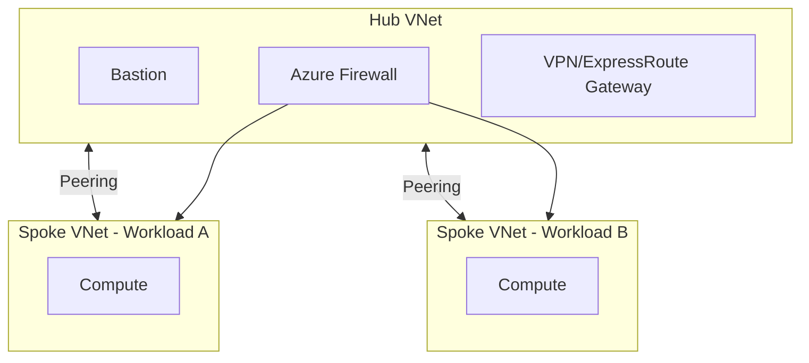

# Azure Hub-Spoke Platform with Terraform & Automated CI/CD

Infrastructure-as-Code reference implementation for a production-style Azure Hub-Spoke network platform — provisioned via Terraform, validated through automated policy checks, and deployed through a gated CI/CD pipeline.

> This is a sanitized, standalone version of patterns used in a production enterprise environment. No real resource names, subscription IDs, or credentials are included.

## What this demonstrates

| Resume claim | Where it lives here |
|---|---|
| Hub-Spoke network architecture with modular design | `terraform/network/` — hub, spoke, and peering modules |
| Reusable Terraform modules (compute, networking, RBAC) | `terraform/modules/` |
| Automated validation (plan/apply/tflint/Checkov) | `.github/workflows/terraform-ci.yml` |
| Zero-Trust enforcement (Firewall, Bastion, Private Endpoints) | `terraform/security/` |
| Gated CI/CD with rollback safeguards | `.github/workflows/` |

## Architecture



## Tech stack
`Terraform` · `Azure (VNet, Firewall, Bastion, ExpressRoute)` · `GitHub Actions` · `Checkov` · `TFLint` · `Azure Policy`

## Repository structure
```
.
├── terraform/
│   ├── network/          # Hub-Spoke VNets, peering, firewall rules
│   ├── modules/
│   │   ├── compute/      # Reusable VM/scale-set module
│   │   └── networking/   # Reusable VNet/subnet module
│   └── security/         # Private endpoints, NSGs, policy assignments
├── .github/workflows/
│   └── terraform-ci.yml  # plan → tflint → checkov → apply (with approval gate)
└── README.md
```

## How to run
```bash
cd terraform/network
terraform init
terraform plan -var-file="example.tfvars"
```
> Requires an Azure subscription and `az login`. `example.tfvars` uses placeholder values — replace before applying to your own environment.

## What this doesn't include
Real ANZ Bank infrastructure, subscription IDs, or proprietary pipeline configs — this repo recreates the same architectural pattern from scratch for demonstration purposes.

## License
MIT — see [LICENSE](LICENSE)
